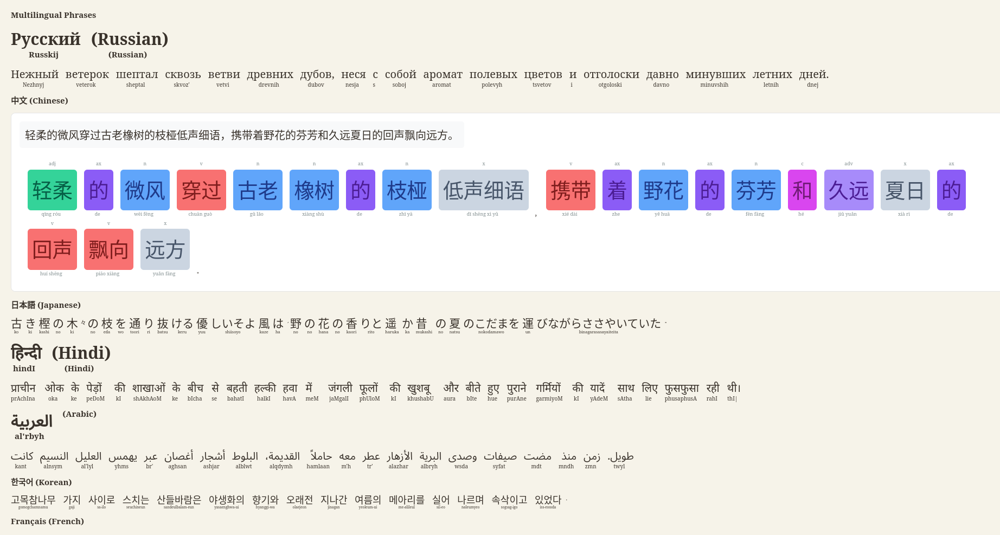

# For What

- Multilingual Products, Tools for Reading/Listening: [de, it, fr, ru, zh-ch, jp, hi, ar, ko, en, es ]
- Transliteration: SUPPORTED_LANGUAGES = ["japanese", "korean", "chinese", "hindi", "arabic", "russian"]
- Consistent with patterns from Calibre Translation Plugin

# How to Use, Download and Install

Menu.md

## Requeriments

python_version = "3.12"

[See Zaya's Books](https://github.com/zayabarrini/zayasbooks)

[Grammar Rules](https://github.com/zayabarrini/zayas-grammar-db)

# Main usage



## Epub Versions

### Transliteration: transliterate_epub(epub_path, language)

Use process_html_content_multilingual for texts with multiple languages for transliteration

### merge_multiple_epubs(epub_paths, output_path, languages, merge_order)

Merge different dual translations of the same Epub into one

```python
epub_paths = [
        '/folder/filename-db-de.epub',
        '/folder/filename-db-ru.epub',
        '/folder/filename-db-fr.epub',
        '/folder/filename-db-it.epub',
        '/folder/filename-db-ch.epub'
    ]

    languages = ['de', 'ru', 'fr', 'it', 'zh']
    merge_order = ['de', 'ru', 'fr', 'it', 'zh']
    output_path = '/folder/filename-ml-de-ru-fr-it-ch.epub'
```

#### epubMergeFolder.py process a folder

### remove_original(epub_path)

Remove different combinations of languages

### WordList process .csv files

## start-chinese-session.sh

Starts webChineseColor-coded.py and grammar-db (Contains language grammar rules)

## subtitles2epub.sh

Takes a list of .txt, .md, .srt files and compile into EPUB

### subtitles/zip2zipMultilingual.py

Compose multiple language subtitles with transliteration

# Syntax, Grammatical Classes - Chinese

```python
def analyze_chinese_syntax(text):
    """Return simplified POS tags from pseg"""
    words = list(pseg.cut(text))
    syntax_data = []

    for word, pos in words:
        # Map jieba POS tags to simplified categories
        if is_punctuation(word):
            category = "punct"
        elif pos.startswith('n'):  # nouns
            category = "n"
        elif pos.startswith('v'):  # verbs
            category = "v"
        elif pos.startswith('a'):  # adjectives
            category = "adj"
        elif pos.startswith('d'):  # adverbs
            category = "adv"
        elif pos.startswith('m'):  # numerals
            category = "nm"
        elif pos.startswith('r'):  # pronouns
            category = "r"
        elif pos.startswith('p'):  # prepositions
            category = "p"
        elif pos.startswith('c'):  # conjunctions
            category = "c"
        elif pos.startswith('u'):  # auxiliary
            category = "ax"
        elif pos.startswith('y'):  # modal particles
            category = "mp"
        elif pos.startswith('q'):  # quantifiers
            category = "q"
        elif pos.startswith('e'):  # interjections
            category = "o"
        elif pos.startswith('o'):  # onomatopoeia
            category = "o"
        else:
            category = "x"  # other

        syntax_data.append((word, category, pos))

    return syntax_data
```

```python
def get_grammatical_classes_from_pos(pos_tag):
    """Map jieba POS tags to grammatical classes"""
    pos_mapping = {
        # Nouns
        'n': 'noun', 'nr': 'proper noun', 'ns': 'place noun', 'nt': 'organization noun',
        'nz': 'other proper noun', 'nl': 'location noun', 'ng': 'nominal morpheme',

        # Verbs
        'v': 'verb', 'vd': 'adverbial verb', 'vn': 'nominal verb',
        'vshi': '是 verb', 'vyou': '有 verb', 'vf': 'direction verb',
        'vx': 'auxiliary verb', 'vi': 'intransitive verb', 'vl': 'linking verb',
        'vg': 'verb morpheme',

        # Adjectives
        'a': 'adjective', 'ad': 'adverbial adjective', 'an': 'nominal adjective',
        'ag': 'adjective morpheme', 'al': 'adjective-like',

        # Adverbs
        'd': 'adverb', 'dg': 'adverb morpheme',

        # Pronouns
        'r': 'pronoun', 'rr': 'personal pronoun', 'rz': 'demonstrative pronoun',

        # Numerals
        'm': 'numeral', 'mq': 'quantifier numeral',

        # Quantifiers
        'q': 'quantifier', 'qv': 'verbal quantifier', 'qt': 'temporal quantifier',

        # Prepositions
        'p': 'preposition', 'pba': '把 preposition', 'pbei': '被 preposition',

        # Conjunctions
        'c': 'conjunction', 'cc': 'coordinating conjunction',

        # Auxiliary
        'u': 'auxiliary', 'uzhe': '着 auxiliary', 'ule': '了/喽 auxiliary',
        'uguo': '过 auxiliary', 'ude1': '的/底 auxiliary', 'ude2': '地 auxiliary',
        'ude3': '得 auxiliary', 'usuo': '所 auxiliary', 'udeng': '等/等等 auxiliary',
        'uyy': '一样/一般 auxiliary', 'udh': '的话 auxiliary',

        # Particles
        'y': 'particle', 'yg': 'particle morpheme',

        # Interjections
        'e': 'interjection',

        # Onomatopoeia
        'o': 'onomatopoeia',

        # Others
        'h': 'prefix', 'k': 'suffix', 'x': 'non-morpheme', 'xx': 'unknown',
        'w': 'punctuation'
    }

    return pos_mapping.get(pos_tag.lower(), pos_tag.lower())
```
