# Chinese color-coded transliteration

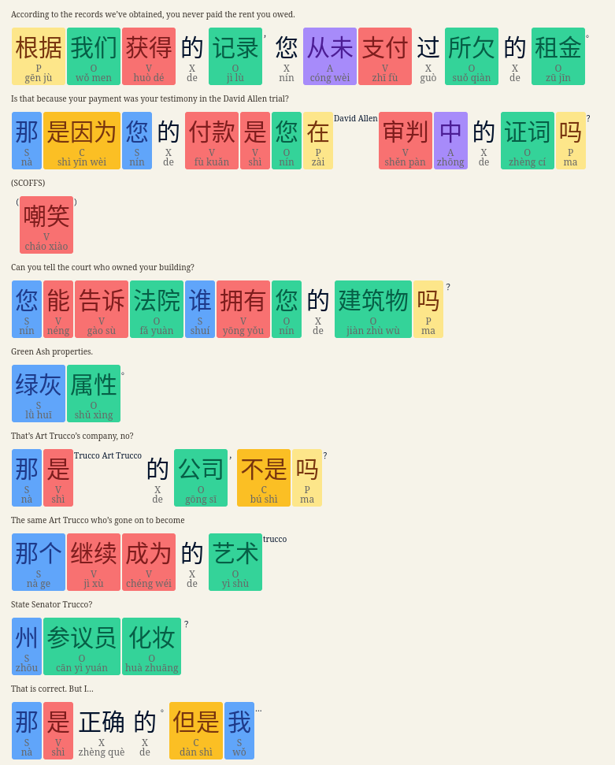

# History

## Transliteration for: ru, ch, ja, ar, hi, ko

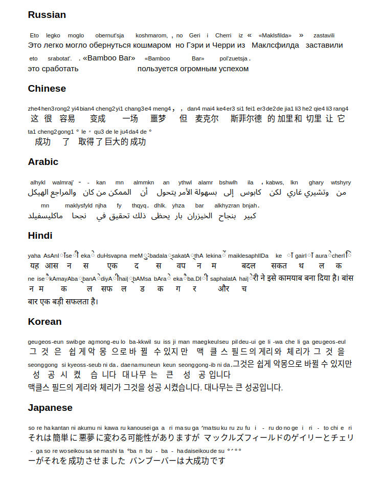

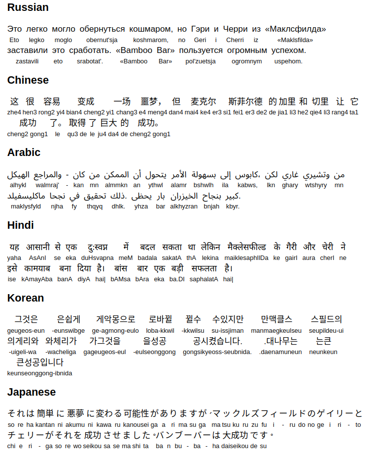

## Arabic on phone

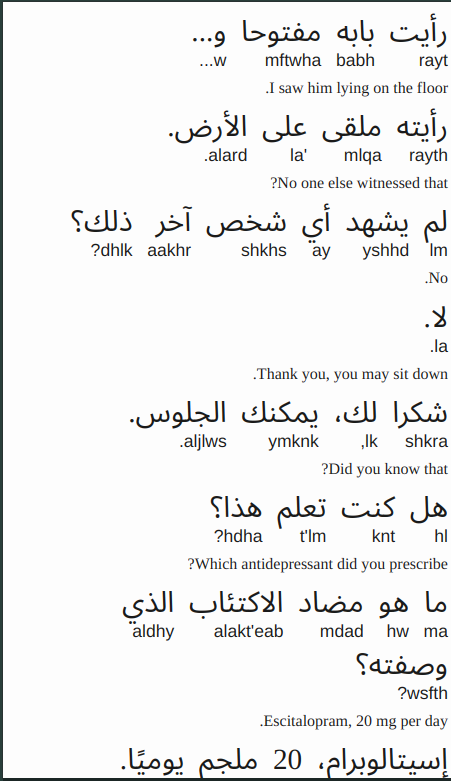

## Parallel Translation

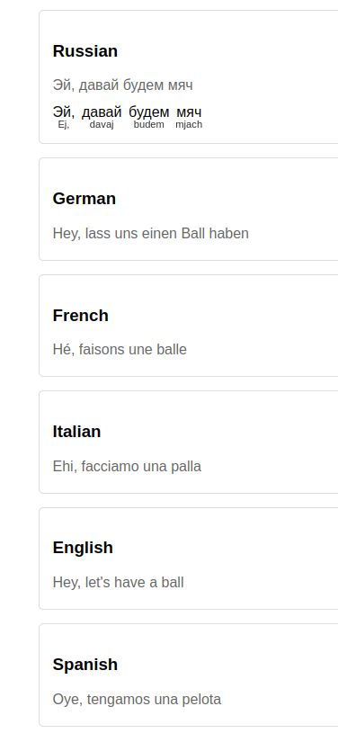

## Syntax Markers

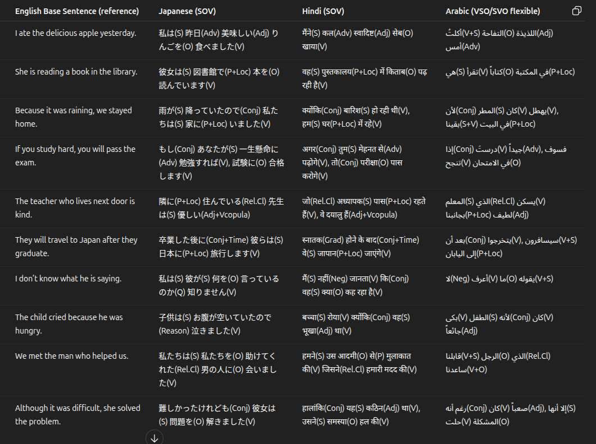

## Color-coded syntax for Ja, Ar, Hi

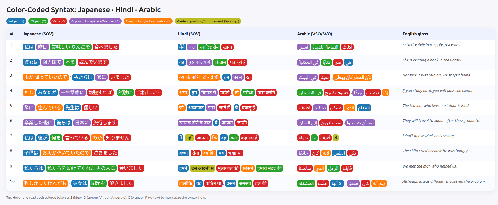

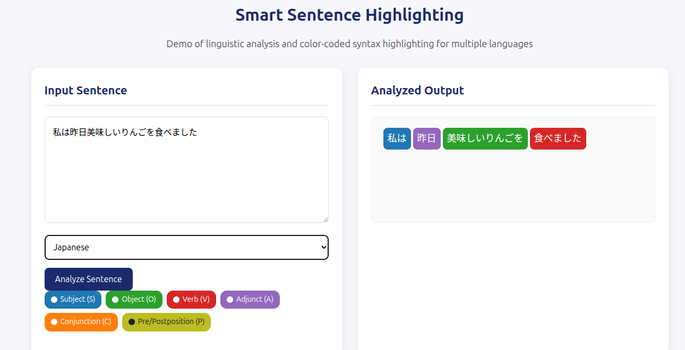

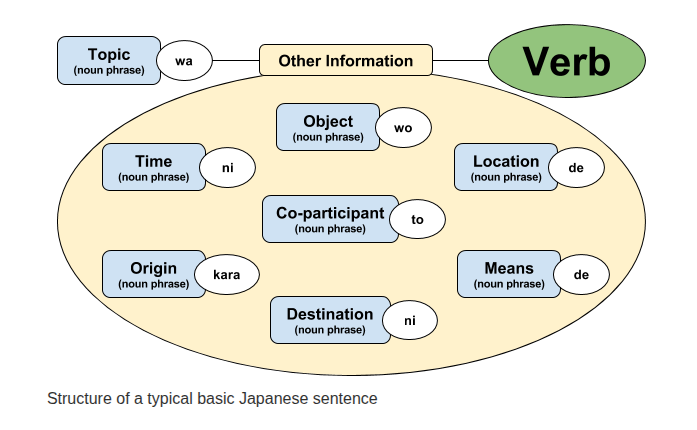

### With translation

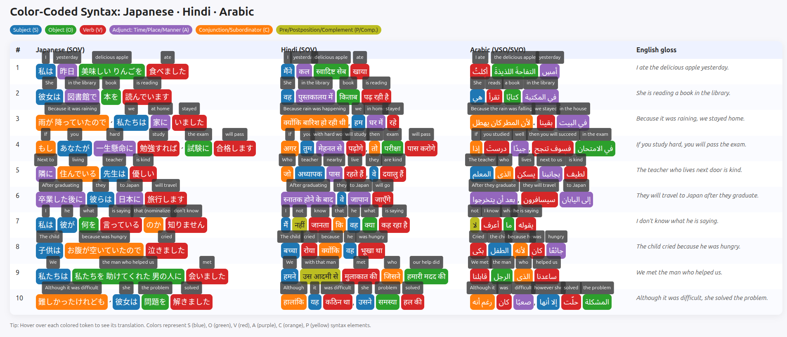

## Parallel Learning and progress tracking

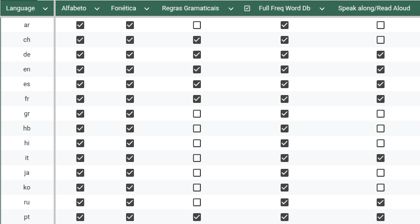

## Music

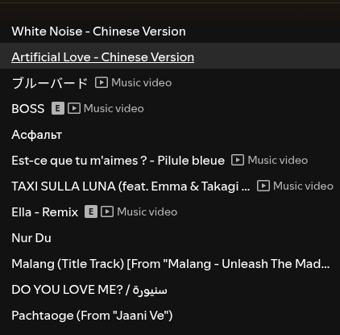

## Multilingual Epub

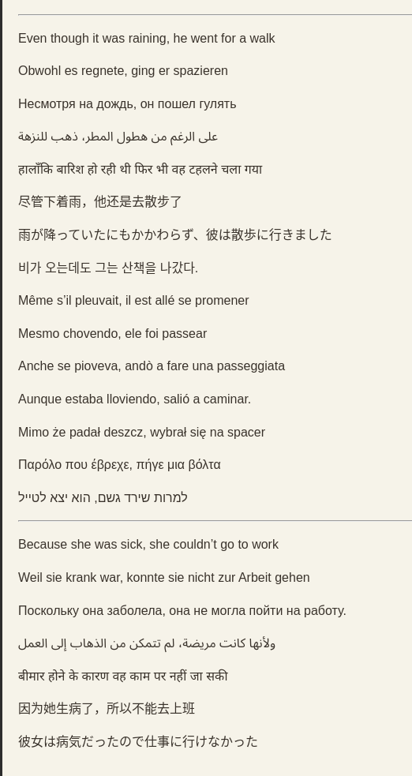

